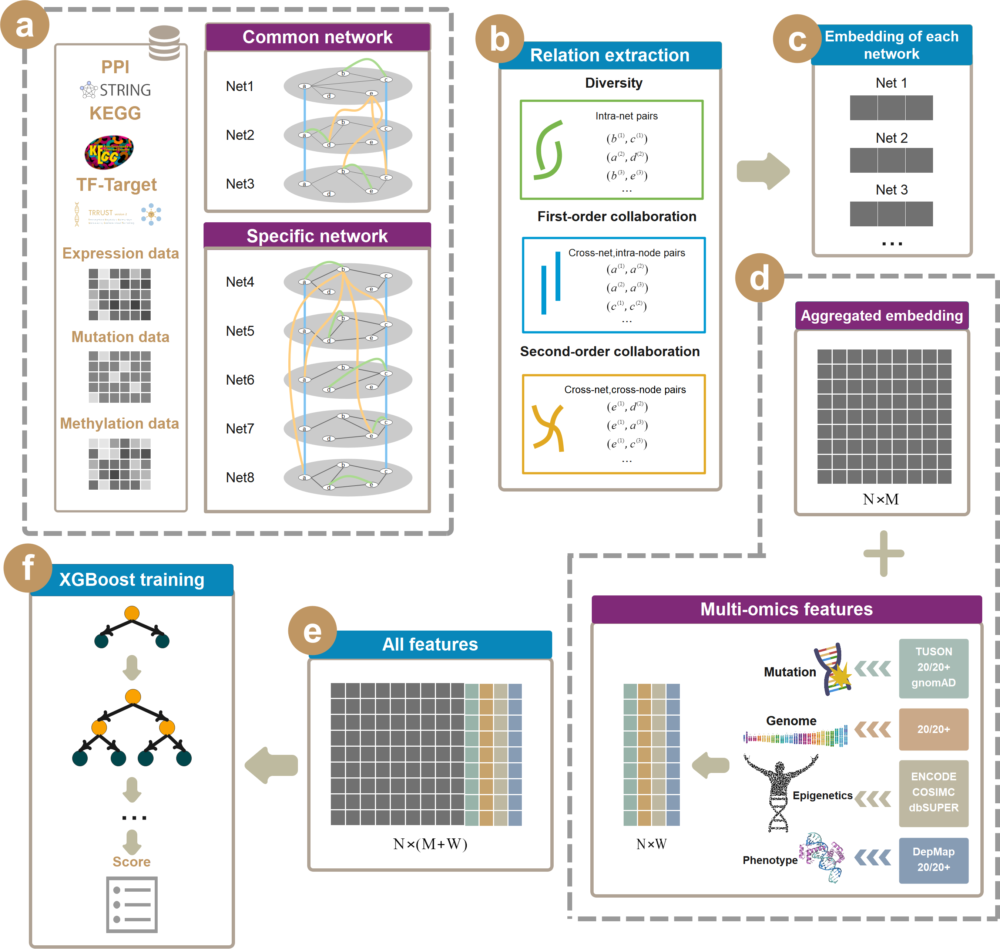

# IMI-Driver

In this study, we present IMI-driver, a model that integrates multi-omics data into eight biological networks and applies Multi-view Collaborative Network Embedding to embed the gene regulation information from the biological networks into a low-dimensional vector space to identify cancer drivers.



IMI-driver builds various networks based on multi-omics data (gene expression, miRNA expression, DNA methylation, and somatic mutations), such as gene dependency network, competing endogenous RNA network, gene co-expression network, DNA methylation interaction network and co-mutations network, to capture the multidimensional interactions of carcinogenesis for each cancer type. It also incorporates other networks that reflect common gene interactions, such as protein-protein interaction network, gene pathway similarity network and transcriptional regulatory network. Then, it applies Multi-view collAborative Network Embedding to embed gene interaction pairs in different networks into a low-dimensional vector space. In addition, it also integrates biological features extracted from multi-omics data of each gene as features. Finally, it uses XGBoost to build a prediction model based on the embedded vectors. We demonstrate that IMI-Driver outperforms existing methods on several benchmark datasets and reveals some novel driver genes with biological evidence.

The following depicts a broad overview over the IMI-Driver.

## Overview

The project consists of four main parts:

1. Data preprocessing: `/Preprocessing`
2. Constructing network: `/Network`
3. Network embedding: `/Cancer_MANE`
4. Experiment:`/Experiment` (including Performance Comparison, Network Evaluation, Ablation Experiment, Survival Analysis.)
5. Visualization: `/Plot`

Due to the fact that many network construction algorithms stem from methods previously developed in our laboratory, and these methods were implemented using MATLAB, our project employs both MATLAB and Python for development. MATLAB is primarily utilized for data preprocessing and network construction, while Python code handles network embedding, model construction, and validation. Recognizing that many developers are more accustomed to using Python, users can start directly from step 3, leveraging the network data preconstructed using our MATLAB code.

## Installation & Dependencies

- Matlab2018+
- Scikit-learn 0.19.1 
- Numpy 1.15.4 
- Scipy 1.2.0 
- Torch 0.4.1 
- Python 3.5+

Compatible with both cuda and cpu devices, depending on the user choice through arg_parser file. Also compatible with python2 and python3.

```
git clone --recursive https://github.com/coding0lion/IMI-Driver.git
cd IMI-driver
```

Then create the virtual environment, activate it, and install the dependencies:

```
pip install -r requirements.txt
```

## Required files

If you want to reproduce our results, you can download the data from [here](https://doi.org/10.5281/zenodo.7674019).

## Implementation

**Step 1:** Download data. 

Due to the huge amount of raw data in The Cancer Genome Atlas (TCGA), I will only take breast cancer(BRCA) as an example to introduce the processing of the raw data, the data are available for download at [here](https://doi.org/10.5281/zenodo.10430976) (See `/Raw_Data` for raw data of BRCA, other raw cancer data you can download from TCGA), and the specific process is described in `./Preprocessing`

At the same time, the remaining processed cancer data is also available [here](https://doi.org/10.5281/zenodo.7674019).

**Step 2:** Network construction.

Before proceeding with the network construction, make sure you have downloaded the data from [here](https://doi.org/10.5281/zenodo.10430976), then put the `data` from the downloaded files into `./Network` and put the `ceRNA` directory in `./Network/ceRNA`.

1、 Construct specific networks

```
cd ./Network
matlab all_net_demo.m
```

`matlab all_net_demo.m` can generate  **specific  network** includes gene dependency network (GDN), competing endogenous RNA (ceRNA) network, gene co-expression network ( GCN), DNA methylation interaction network (DMIN), co-mutations network (DCMN).

2、Construct common networks

The common network consists of gene pathway similarity network (GPSN), protein-protein interaction (PPI) network and transcriptional regulatory network, which are the same for each cancer. See `/IMI-driver/Network/REDME.md` for the specific construction process.

You can base on our data generation network or use your own data, see REAME for details. 

You can use the following code to convert an adjacency matrix to an adjacency table for later network embedding:

```
matlab demo_pair2table.m
```

Here we also provide all the cancers we use that have been constructed for the network, which you can find [here](https://doi.org/10.5281/zenodo.10430976)(See `/Network_Data` for individual cancer networks).

**Step 3:** Network embedding.

Before performing the network embedding you need to ensure that the network data has been placed in `./Cancer_MANE/attention/Node_Classification/data/networks/Cancer`.

If you want to do network embedding directly, you can use the [network data](https://doi.org/10.5281/zenodo.10430976)(`/Network_Data`) we have already constructed, and you will need to put it into `./Cancer_MANE/attention/Node_Classification/data/networks/Cancer`.

```
cd ./Cancer_MANE/attention/Node_Classification
python main_Node_Classification_MANE_Attention.py  --dimensions <Dimensions We set it to 64.>  --epochs <epochs> --nview <It depends on the number of embedded networks> --cancer <cancer>
```

Network embedding results will be saved in `./Cancer_MANE/attention/Node_Classification/output/emb/xgboost`.

**Step 4:** Driver gene prediction.

The XGBoost algorithm is utilized to build a prediction model based on the embedded vectors.

```
cd ./Cancer_MANE/attention/Node_Classification/output/emb/xgboost
python Driver_prediction.py
```

**Step 4:** Experiment.

You can use the documentation in Experiment to perform ablation experiments and randomized gene pooling experiments.

##  Data collection

We used various different data sets from the community to train and validate IMI-Driver. For deriving positive and negative labels, as well as for functional validation and relationships to other cancer gene sets, a diverse set of data sets were used. Links to the databases and publications can be found below.

We obtained multi-omics data (gene expression, clinical data, somatic mutation, methylation data) of 29 cancer types (see Supplementary Table 1 for more details) from The Cancer Genome Atlas (TCGA) via UCSC Xena [1]. 

The human protein-protein interaction (PPI) data were downloaded from the STRING database v.11.0 [2]. 

The KEGG pathway data were retrieved from KEGG [3]. 

The transcription factor-target network was collected from TRRUST [4]. 

We also downloaded 45 biological traits from DORGE [5].

To evaluate the IMI-Driver, an unbiased and comprehensive set of known cancer genes is needed. Unfortunately, there is no such gold standard set of cancer genes, and each cancer gene set is biased toward particular features or study methods. In this work, we used nine cancer driver datasets (see Supplementary Table 2 for more details) to validate our approach, such as Cancer Gene Census (CGC; Tier 1; January 2019) [6], CGCpointMut, 20/20 Rule [7], HCD [8], OncoGene [9], CTAT, MouseMut [10], ConsistentSet and IntOGen [11], where IntOGen is a tumor-specific dataset. We selected 17 cancers that were shared between IntOGen and TCGA data when this data set was used to validate IMI-Driver.

> [1]Goldman MJ, Craft B, Hastie M, et al. Visualizing and interpreting cancer genomics data via the Xena platform. Nat Biotechnol 2020; 38:675–678
>
> [2]Szklarczyk D, Gable AL, Nastou KC, et al. The STRING database in 2021: customizable protein–protein networks, and functional characterization of user-uploaded gene/measurement sets. Nucleic Acids Res 2021; 49:D605–D612
>
> [3]Klukas C, Schreiber F. Dynamic exploration and editing of KEGG pathway diagrams. Bioinformatics 2007; 23:344–350
>
> [4]Han H, Cho J-W, Lee S, et al. TRRUST v2: an expanded reference database of human and mouse transcriptional regulatory interactions. Nucleic Acids Res 2018; 46:D380–D386
>
> [5]Lyu J, Li JJ, Su J, et al. DORGE: Discovery of Oncogenes and tumoR suppressor genes using Genetic and Epigenetic features. Science Advances 2020; 6:eaba6784
>
> [6]Sondka Z, Bamford S, Cole CG, et al. The COSMIC Cancer Gene Census: describing genetic dysfunction across all human cancers. Nat Rev Cancer 2018; 18:696–705
>
> [7]Vogelstein B, Papadopoulos N, Velculescu VE, et al. Cancer Genome Landscapes. Science 2013; 339:1546–1558
>
> [8]Tamborero D, Gonzalez-Perez A, Perez-Llamas C, et al. Comprehensive identification of mutational cancer driver genes across 12 tumor types. Sci Rep 2013; 3:2650
>
> [9]Liu Y, Sun J, Zhao M. ONGene: A literature-based database for human oncogenes. J Genet Genomics 2017; 44:119–121
>
> [10]Kim E, Hwang S, Kim H, et al. MouseNet v2: a database of gene networks for studying the laboratory mouse and eight other model vertebrates. Nucleic Acids Res 2016; 44:D848-854
>
> [11]Gonzalez-Perez A, Perez-Llamas C, Deu-Pons J, et al. IntOGen-mutations identifies cancer drivers across tumor types. Nat Methods 2013; 10:1081–1082

## Citation

`Shi P & Zhou X."IMI-driver: integrating multi-level gene networks and multi-omics for cancer driver gene identification". In preparation.`

## License
- For academic research, please refer to MIT license.

- For commerical usage, please contact the authors.

## Contact

- Peiting Shi [lion23@webmail.hzau.edu.cn](mailto:lion23@webmail.hzau.edu.cn)

- Xionghui Zhou [zhouxionghui@mail.hzau.edu.cn](mailto:zhouxionghui@mail.hzau.edu.cn)

  
